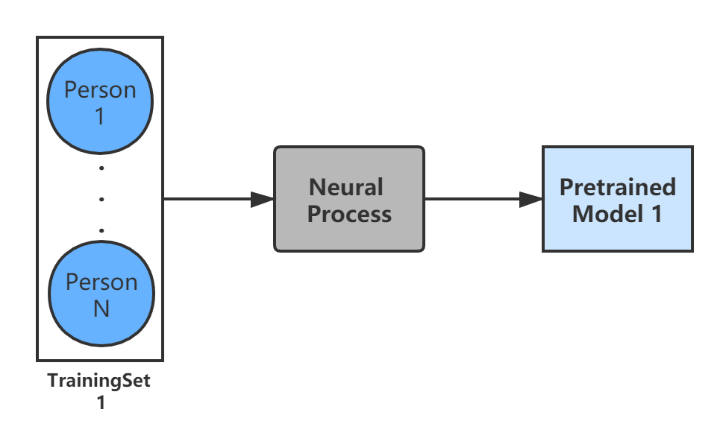
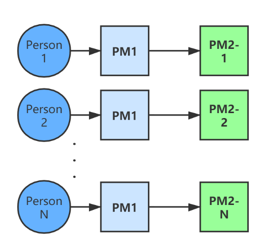
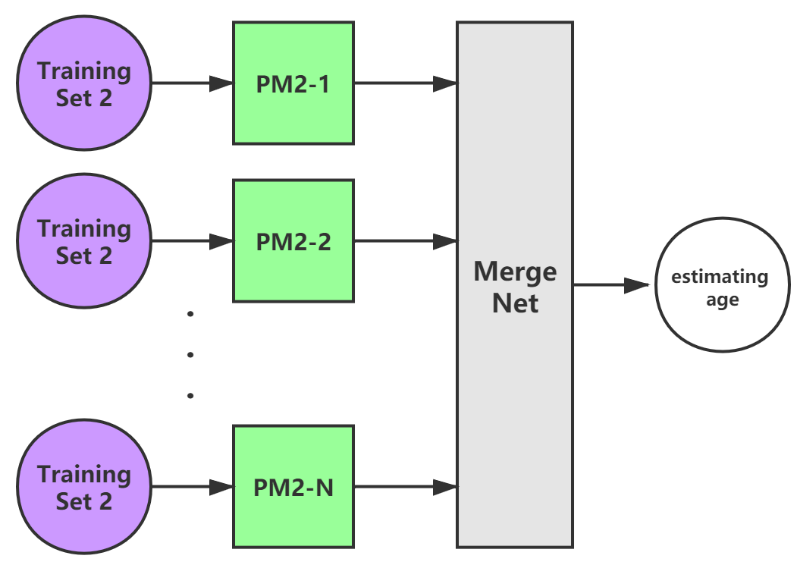

# Age Estimation based on Multi-task Neural Process

Pytorch implementation of [Neural Processes](https://arxiv.org/abs/1807.01622). This repo follows the
best practices defined in [Empirical Evaluation of Neural Process Objectives](http://bayesiandeeplearning.org/2018/papers/92.pdf).

## Training pipeline

We sort all the images into groups by each person. And use data augmentation to make sure the number of images for each person are same. 

Each group of face images is denoted as Personi.

Training Set 1 consists of N group of face images (Personi...n)

Training Set 2 consists of M groups of face images(Personn+1...n+m) which are all different from the components in Training Set 1.

### Training Round 1

Firstly, using the Training Set 1 to train the original Neural Process to get the Pretrained Model 1 which we denote as PM1. We consider each person as a different task in this process. In this round, we used the whole training set to make NP learn all tasks together. In this way, the Pretrained Model we get contains a general encoder which shares the same parameters in different tasks. 

### Training Round 2

Then we train the PM1 separately with different Personi in Training Set 1 to get corresponding model PM2-i. In this process, the encoder part is fixed, we just use different task to train the decoder part. According to this, each PM2-i we get shares the same encoder part but possesses their unique decoder.

### Training Round 3

In order to do the age estimation with all these pretrained model, there should be a Merge Net. The Merge Net is here to learn how to compute the similarity between the input images and our training subjects, and then provide the weight to each result we get from PM2-i. The sum of the products of weights and predictions we get from PM2-i will be the final estimating age.

## Current Demo

Our current progress can be seen in "./experiment/multi-task-example-ageEstimation.ipynb".

## TODO

The model is just a toy model now.

we haven't finetune it and maybe we should add more hidden layers to improve the performance

